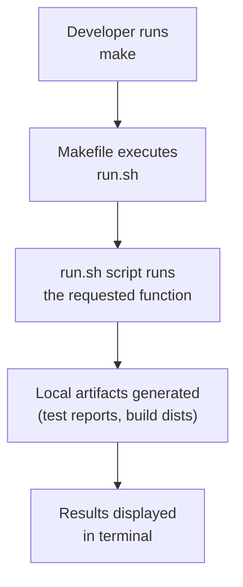
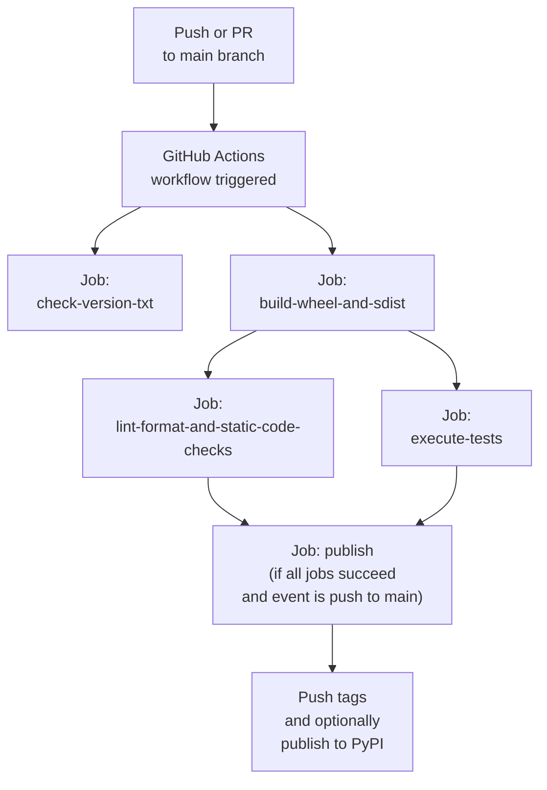

# CI/CD Pipeline Diagrams

This document provides diagrams for both the internal and external CI/CD pipelines used in the hr_analysis project.

---

## Internal CI/CD Pipeline (Makefile-based)

-   **Trigger**: Manual execution by the developer.
-   **Environment**: Local developer machine.
-   **Logic**: The `Makefile` acts as a simple command runner, delegating all tasks to the `run.sh` script. This keeps the CI logic centralized.
-   **Use Case**: Quick, iterative development cycles for linting, testing, and building before committing code.

---

## External CI/CD Pipeline (GitHub Actions)

-   **Trigger**: Automatic on `push` to `main`, `pull_request` to `main`, or `workflow_dispatch`.
-   **Environment**: GitHub-hosted runners (`ubuntu-latest`).
-   **Logic**: A multi-job workflow with dependencies. Artifacts (wheel/sdist) are passed between jobs to ensure that the exact same built package is tested and published.
-   **Use Case**: Automated quality assurance, continuous integration, and continuous deployment/delivery.

---

These diagrams illustrate the flow and responsibilities of both internal and external CI/CD pipelines in the project.
