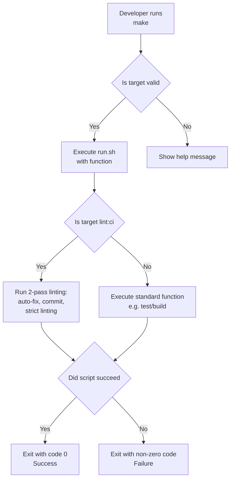
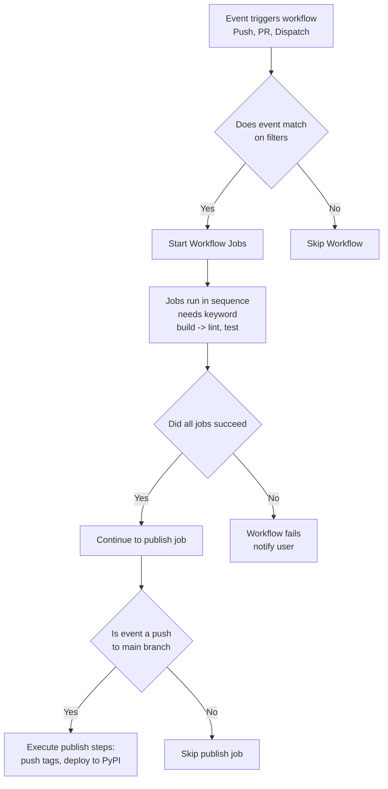

# Conditional CI/CD Pipeline Diagrams

This document illustrates the conditional logic and decision points within the CI/CD pipelines of the `hr_analysis` project.

---

## Internal CI/CD (Makefile-based)

- **Initial Check**: The `Makefile` first validates if the provided target exists.
- **`lint:ci` Logic**: This specific target has a unique two-pass mechanism to automatically fix and commit linting errors before a final strict check.
- **Error Handling**: The `run.sh` script is set to `set -e`, meaning it will exit immediately if any command fails, signaling a failure to the developer.

---

## External CI/CD (GitHub Actions)

- **Event Filtering**: The workflow only runs if the triggering event matches the conditions defined in the `on` section.
- **Job Dependencies**: The `needs` keyword creates a dependency graph, ensuring jobs run in the correct order. A failure in a dependency (e.g., `build-wheel-and-sdist`) will cause dependent jobs (e.g., `execute-tests`) to be skipped.
- **Conditional Publishing**: The `publish` job has a strict `if` condition, ensuring it only runs after all other jobs have succeeded *and* the trigger was a push to the `main` branch.

---

These diagrams clarify the decision-making processes that govern the CI/CD pipelines.
